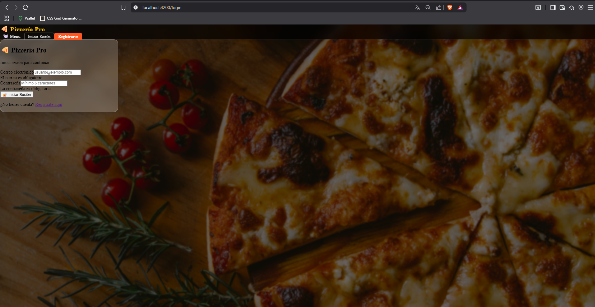
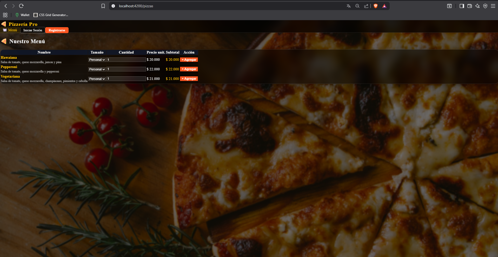
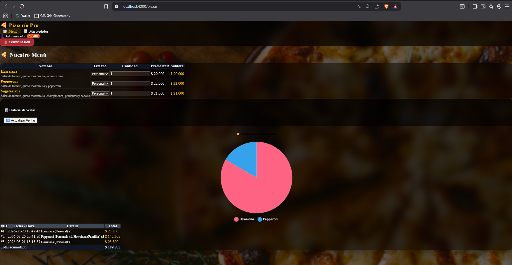

# 🍕 Pizzería Pro — FullStack

**Autor:** Camilo Martinez
**Versión:** 5.0
**Fecha:** 21/03/2026

Aplicación fullstack desacoplada para gestión de pedidos de pizzería. Backend en **Python/Flask** con autenticación **JWT** y base de datos **SQLite**. Frontend en **Angular 17+** con arquitectura standalone, diseño **Glassmorphism** y protección de rutas con **AuthGuard**.

---

## ✨ Características Principales

- 🛡️ **Panel de Administración protegido con roles** — Solo usuarios con rol `admin` acceden al historial de ventas y estadísticas. El acceso está protegido a nivel de backend (JWT) y frontend (AuthGuard + `*ngIf` por rol).
- 📊 **Gráfica de ventas interactiva con Chart.js** — Pie chart con distribución de unidades vendidas por tipo de pizza, colores neón sobre fondo oscuro y tooltips personalizados.
- 🔐 **Autenticación segura con JWT y AuthGuard** — Registro y login con contraseña encriptada (`werkzeug`), token HS256 con expiración de 24h, `AuthInterceptor` que inyecta el token en cada petición y logout automático ante error 401.
- 💎 **Interfaz moderna y responsiva con efecto cristal** — Glassmorphism real: `backdrop-filter: blur(15px)` + `rgba(0,0,0,0.5)` sobre fondo rústico de pizzería. Paleta Crema `#F5F5F5`, Dorado `#FFC107`, Naranja `#FF5722`.

---

## 📸 Capturas de Pantalla

### 📸 Vista de Login y Registro


### 📸 Vista de Usuario (Menú y Pedidos)


### 📸 Vista de Administrador (Dashboard y Gráficas)


---

## 🚀 Guía de Instalación

### Requisitos previos

- Python 3.10+
- Node.js 20+ y Angular CLI (`npm install -g @angular/cli`)
- Git

### 1. Clonar el repositorio

```bash
git clone https://github.com/tu-usuario/pizzeria-pro.git
cd pizzeria-pro
```

### 2. Backend (Flask — puerto 5000)

```bash
# Instalar dependencias de Python
pip install -r backend/requirements.txt

# Levantar el servidor Flask
python backend/app.py
```

Al arrancar verás en consola:
```
[INFO] Base de datos lista: .../pizzeria.db
[INFO] Usuario admin creado: admin@pizzeria.com / admin1
 * Running on http://127.0.0.1:5000
```

Verificar que el backend responde: `http://127.0.0.1:5000/api/health`

### 3. Frontend (Angular — puerto 4200)

```bash
cd frontend

# Instalar dependencias de Node
npm install

# Levantar el servidor de desarrollo
ng serve
```

Abrir en el navegador: `http://localhost:4200`

### 4. Ejecutar tests

```bash
# Desde la raíz del proyecto
pytest tests/ -v
```

Resultado esperado: **12 passed** ✅

---

## 🔑 Credenciales de Prueba

### Usuario Administrador — Panel de Ventas y Gráficas

```
Email:    admin@pizzeria.com
Password: admin1
```

> El usuario admin se crea automáticamente al arrancar el backend por primera vez. Con estas credenciales puedes ver el historial completo de ventas y la gráfica de distribución por pizza.

### Usuario Cliente

Navega a `/registro` o haz clic en **"¿No tienes cuenta? Regístrate aquí"** desde el login para crear una cuenta nueva.

---

## 🏗️ Arquitectura

```
Pizzeria-Pro/
├── backend/
│   ├── app.py          → API REST Flask + JWT + seed admin automático
│   ├── database.py     → Modelos ORM: Pedido, ItemPedido, Usuario
│   ├── models.py       → Dataclasses Python (dominio)
│   └── requirements.txt
├── frontend/
│   └── src/app/
│       ├── models/         → Interfaces TypeScript (Pizza, Usuario)
│       ├── services/       → PizzaService, AuthService
│       ├── interceptors/   → AuthInterceptor (JWT en headers)
│       ├── guards/         → AuthGuard (protección de rutas)
│       └── components/
│           ├── navbar/         → Navbar persistente glassmorphism
│           ├── login/          → Formulario reactivo con validaciones
│           ├── registro/       → Registro de nuevos usuarios
│           ├── pizza-list/     → Menú + carrito + panel admin + Chart.js
│           └── mis-pedidos/    → Historial personal del cliente
└── tests/              → Suite Pytest (12 tests)
```

---

## 🛠️ Tecnologías

| Capa | Tecnología | Versión |
|------|-----------|---------|
| Backend | Python | 3.10+ |
| Backend | Flask | 3.x |
| Backend | Flask-CORS | 4.x |
| Backend | Flask-SQLAlchemy | 3.x |
| Backend | PyJWT | 2.x |
| Backend | Werkzeug | 3.x |
| Frontend | Angular | 17+ (Standalone) |
| Frontend | TypeScript | 5.x (strict) |
| Frontend | Chart.js | 4.x |
| Frontend | Bootstrap | 5.x |
| Testing | Pytest | 8.x |

---

## 📡 API Endpoints

| Método | Ruta | Auth | Descripción |
|--------|------|------|-------------|
| `GET` | `/api/health` | No | Health check |
| `GET` | `/api/pizzas` | No | Lista de pizzas con variantes |
| `POST` | `/api/auth/registro` | No | Registro de usuario |
| `POST` | `/api/auth/login` | No | Login, devuelve JWT |
| `POST` | `/api/pedidos` | JWT | Guardar pedido |
| `GET` | `/api/pedidos` | JWT | Historial de pedidos |

---

## 🗺️ Rutas del Frontend

| Ruta | Acceso | Descripción |
|------|--------|-------------|
| `/` | Público | Redirige a `/pizzas` |
| `/pizzas` | Público | Menú + carrito |
| `/login` | Público | Inicio de sesión |
| `/registro` | Público | Crear cuenta |
| `/mis-pedidos` | Autenticado | Historial personal |

---

## ☁️ Despliegue y Configuración

### Backend — Render

El backend corre en [Render](https://render.com) usando **Gunicorn** como servidor WSGI de producción.

**Comando de inicio en Render:**
```
gunicorn app:app
```

**CORS configurado en `app.py`:**

Flask-CORS está habilitado con `resources={r"/*": {"origins": "*"}}` para permitir peticiones desde cualquier origen. Además, se usa un `@after_request` handler como respaldo que inyecta los headers manualmente en cada respuesta, incluyendo las preflight `OPTIONS`:

```python
from flask_cors import CORS

CORS(app, resources={r"/*": {
    "origins": "*",
    "methods": ["GET", "POST", "PUT", "DELETE", "OPTIONS"],
    "allow_headers": ["Content-Type", "Authorization"]
}})

@app.after_request
def agregar_headers_cors(response):
    response.headers["Access-Control-Allow-Origin"] = "*"
    response.headers["Access-Control-Allow-Methods"] = "GET, POST, PUT, DELETE, OPTIONS"
    response.headers["Access-Control-Allow-Headers"] = "Content-Type, Authorization"
    return response
```

`flask-cors` debe estar en `backend/requirements.txt` (ya incluido en versión 4.x).

---

### Frontend — Vercel

El frontend se despliega en [Vercel](https://vercel.com) desde la carpeta `frontend/` como raíz del proyecto.

**`frontend/vercel.json`** — configura el build de producción y el rewrite para SPA:
```json
{
  "buildCommand": "ng build --configuration=production",
  "outputDirectory": "dist/frontend/browser",
  "rewrites": [{ "source": "/(.*)", "destination": "/index.html" }]
}
```

**`frontend/angular.json`** — el `fileReplacements` en la configuración `production` es crítico para que Angular use `environment.prod.ts` en lugar de `environment.ts` (que apunta a `localhost`):
```json
"production": {
  "fileReplacements": [
    {
      "replace": "src/environments/environment.ts",
      "with": "src/environments/environment.prod.ts"
    }
  ]
}
```

Sin esta configuración, Vercel compila con el entorno de desarrollo y el frontend intenta conectarse a `localhost:5000` en lugar de Render.

---

### Variables de Entorno

| Variable | Dónde | Valor |
|----------|-------|-------|
| `JWT_SECRET` | Render (backend) | Clave secreta para firmar tokens JWT |

La URL del backend **no se configura como variable de entorno en Vercel** — se define directamente en `frontend/src/environments/environment.prod.ts`:
```typescript
export const environment = {
  produccion: true,
  apiUrl: 'https://pizzeria-pro.onrender.com/api'
};
```

> La URL debe terminar en `/api` sin barra final.

---

### Checklist de despliegue

- [ ] Render: servicio apunta a `backend/` con comando `gunicorn app:app`
- [ ] Render: variable de entorno `JWT_SECRET` configurada
- [ ] Vercel: raíz del proyecto apunta a `frontend/`
- [ ] `frontend/vercel.json` tiene `buildCommand` con `--configuration=production`
- [ ] `frontend/angular.json` tiene `fileReplacements` en la config `production`
- [ ] `frontend/src/environments/environment.prod.ts` tiene la URL correcta de Render

---

## 🚀 Roadmap

### 🔐 Autenticación Avanzada y Perfiles
Refresh tokens, recuperación de contraseña por email y OAuth2 (Google). Los clientes podrán guardar direcciones de entrega y consultar su historial completo desde cualquier dispositivo.

### 📊 Panel de Business Intelligence
Dashboard administrativo con Chart.js: pizzas más vendidas, horas pico de pedidos y proyecciones de ingresos mensuales. Datos en tiempo real con WebSockets.

### ⚡ Dockerización y Despliegue en la Nube
`docker-compose` con Frontend (Nginx), Backend (Gunicorn) y base de datos. CI/CD con GitHub Actions para despliegue automatizado en AWS/Azure. Escalabilidad garantizada desde el día uno.

---

**Camilo Martinez** — Desarrollador Fullstack · Python & Angular
